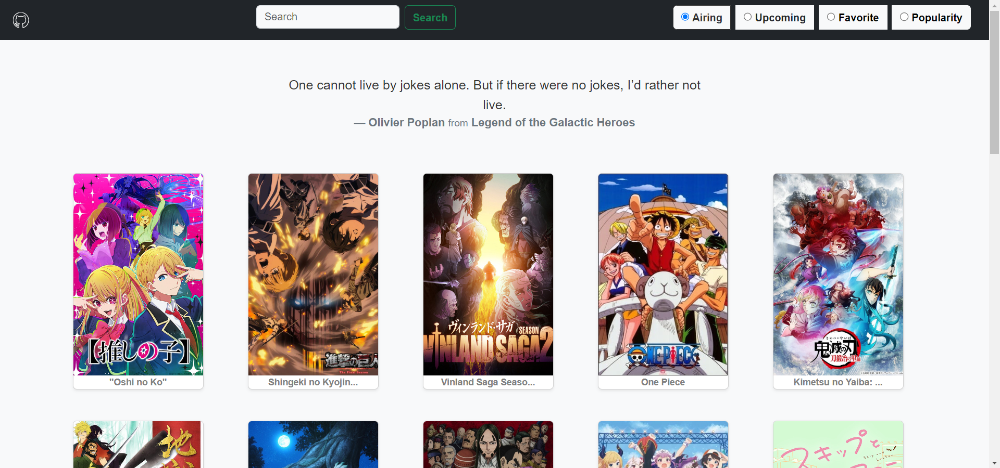

# anime-spot

This is a web application for finding anime and getting information about them. It is built using HTML, JavaScript, CSS, and Bootstrap for the frontend, and the Jikan anime API for the backend.

## Getting Started

To use this application, you need a web browser and an internet connection. **Simply open the index.html file in your browser**, and you should see the homepage of the application.

## Features

The application allows you to search for anime by title or keyword, and get information about them, such as their synopsis, rating, and episode count. You can also see the list of characters in each anime, and their voice actors.

The application uses the Jikan anime API to fetch anime data, so you need an internet connection to use it. The API is free and open source, and does not require any authentication or API key.